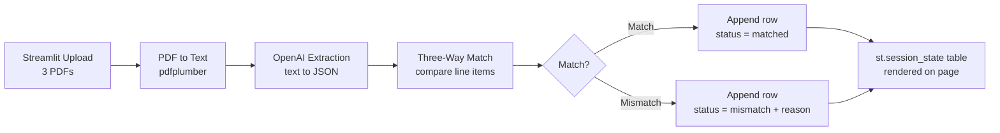

# POC Plan — AP Three-Way Match (Streamlit)

A single-page Streamlit app: upload the three PDFs (PO, Invoice, GRN), extract line items with OpenAI, compare quantities, and show the result as a row in an on-screen table. No database — results live in Streamlit session state for the session.

Goal is to prove the loop — **upload → extract → validate → display** — in one file you can run locally.

---

## 1. Flow



---

## 2. Scope

**In scope**

- Upload three PDFs via the Streamlit UI (PO, Invoice, GRN)
- Extract header + line items from each as structured JSON via OpenAI
- Compare quantities line-by-line: invoice vs PO, GRN vs PO
- Append one result row per run to a table held in `st.session_state`
- Show the running table, plus an expandable per-item breakdown for the latest run

**Out of scope**

- Database — state resets when the app restarts (fine for a demo)
- Email ingestion — manual upload instead
- OCR / scanned docs — digital text only
- SAP posting, payments, reconciliation
- Multi-PO, split shipments, partial deliveries

---

## 3. Components

| #   | Component        | Job                                 | Library                             |
| --- | ---------------- | ----------------------------------- | ----------------------------------- |
| 1   | Uploader         | Three file inputs in the UI         | `streamlit`                         |
| 2   | PDF text extract | PDF → raw text                      | `pdfplumber`                        |
| 3   | LLM extractor    | Text → structured JSON per doc      | `openai`                            |
| 4   | Matcher          | Compare line items, produce verdict | plain Python                        |
| 5   | State + table    | Store and render results            | `st.session_state` + `st.dataframe` |

---

## 4. Data Shapes

**Extracted per document (OpenAI output)**

```json
{
  "doc_type": "invoice",
  "document_number": "INV-2043",
  "po_number": "PO-1187",
  "vendor": "Acme Supplies",
  "line_items": [
    {
      "item_code": "BAT-12V",
      "description": "12V Battery",
      "quantity": 100,
      "unit_price": 450.0
    }
  ]
}
```

Use OpenAI **structured outputs** (`response_format` with a JSON schema) so the model returns valid JSON every time — no parsing of prose or stripping backticks.

**Match logic (per item, matched by `item_code`)**

- Invoice qty **>** PO qty → `over_invoiced`
- Invoice qty **<** PO qty → `under_invoiced`
- GRN qty **≠** PO qty → `receipt_variance`
- Item on invoice but not on PO → `unmatched_item`
- All aligned → `matched`

Overall status = `matched` only if every line item matches; otherwise `mismatch` with reasons collected.

---

## 5. Result Row (in session state)

```python
{
    "po_number": "PO-1187",
    "invoice_number": "INV-2043",
    "grn_number": "GRN-0091",
    "vendor": "Acme Supplies",
    "status": "mismatch",              # or "matched"
    "reason": "over_invoiced: BAT-12V (inv 120 vs po 100)",
    "line_detail": [ ... ],            # per-item comparison, shown in expander
}
```

`st.session_state.results` is a list of these dicts. The table renders every row except `line_detail`; the latest run's `line_detail` shows in an expander below.

---

## 6. Build Order

1. **Skeleton** — Streamlit app with three file uploaders and a "Run match" button.
2. **PDF → text** — on upload, extract and display raw text to confirm parsing.
3. **OpenAI extraction** — send text with a JSON schema, get clean structured JSON back. Tune the prompt until quantities and item codes are reliable.
4. **Matcher** — feed three JSON docs, produce a verdict. Test with a known over/under case.
5. **State + table** — append the verdict to `st.session_state.results`, render with `st.dataframe`.
6. **Polish** — per-item expander, colour the status (green matched / red mismatch), a clear-table button.

---

## 7. Project Layout

```
ap-poc/
├── .env               # OPENAI_API_KEY
├── requirements.txt
├── app.py             # the whole Streamlit app
├── extractor.py       # pdfplumber + OpenAI → JSON
├── matcher.py         # three-way comparison
└── samples/           # test PDFs
```

Small enough that `app.py` alone is fine if you'd rather keep it one file.

---

## 8. Environment

```
# .env
OPENAI_API_KEY=sk-...
```

```
# requirements.txt
streamlit
pdfplumber
openai
python-dotenv
pandas
```

Run with: `streamlit run app.py`

---

## 9. Demo Path

1. Upload a matching PO / Invoice / GRN set → run → one green `matched` row.
2. Upload a set where the invoice quantity exceeds the PO → run → one red `mismatch` row reading `over_invoiced` with the item.
3. Both rows sit in the table together; expand the latest to show the per-item comparison. That's the POC.

---

## 10. Open Questions

- Match on `item_code`, or fall back to description when codes differ across documents?
- Price/amount tolerance (e.g. ±2%), or exact quantity match only for the POC?
- Which OpenAI model — `gpt-4o-mini` (cheap, fine for clean digital PDFs) or `gpt-4o` (stronger on messy layouts)?
